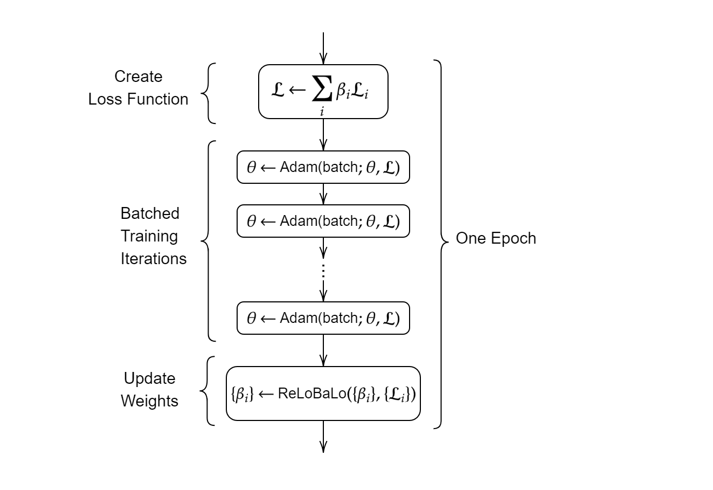
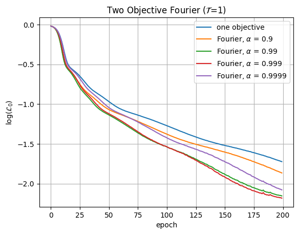
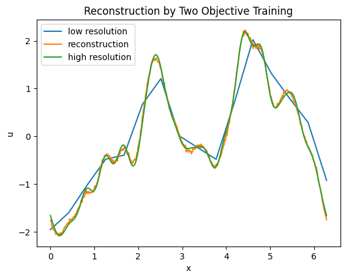
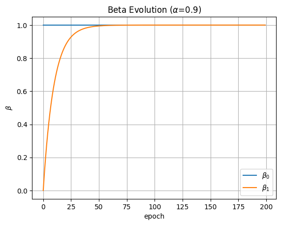
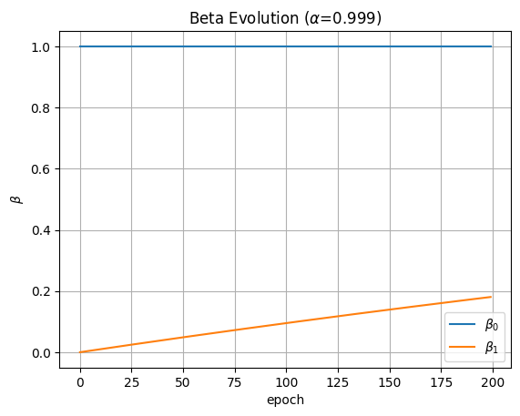
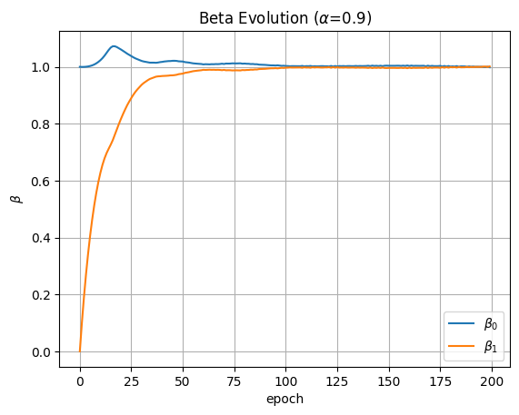

# Super Resolution: Multi-Objective Training for Optimizing a Single Objective
### Julian Powers
## Introduction
Super-resolution (SR) refers to image processing techniques which enhance the quality of low-resolution images [2]. Recently deep learning based SR has been applied to the field fluid dynamics to recreate chaotic turbulent flows from low-resolution experimental or numerical data [3]. For some loss function $\mathcal{L}$, the goal is to find weights $\theta^*$ such that

$$\begin{aligned}
	\theta^* = \text{argmin}_\theta\; \mathcal{L}(\mathbf{u_H},f(\mathbf{u_L};\mathbf{\theta}))
\end{aligned}$$

where $\bf u_H$ is the reference high resolution data field and $\bf u_L$ is the corresponding coarsened low resolution data input to the neural network $f$ (see the figure below).

![Super-resolution reconstruction of turbulent vorticity field using physics-based neural network. Adapted from [2].](/assets/img/2023-12-12-physics_loss/fig1.png)

​	*Fig 1: Super-resolution reconstruction of turbulent vorticity field using physics-based neural network. Adapted from [2]. Disclaimer: we didn't have time to train on nice images like these for the present investigation.*

Doing so can aid our understanding of flow physics [3]. Many have already applied deep learning to this problem, applying a variety of methods. The performance of the resulting networks depends heavily on the loss function used to train the network. Looking to improve upon the standard $L_2$ loss function, some have introduced physics-based loss function that incorporates physical laws that the real flow must obey. For example [2] use the following type of form: 

$$\begin{aligned}
	\mathcal{L} &= \beta_0||\mathbf{u_H}-f(\mathbf{u_L})||_2 + \beta_1 ||p_1(\mathbf{u_H})-p_1(f(\mathbf{u_L}))||_2 +  \beta_2 ||p_2(\mathbf{u_H})-p_2(f(\mathbf{u_L}))||_2 + ... 
\end{aligned}$$ 

where $p_i(\cdot)$ is a physical objective that we want to enforce during training (e.g. spatial and time derivatives $\nabla \bf u_H$, $\bf\dot{u}_H$ etc.) and the $\beta_i$ are fixed weighting coefficients.

Typically, multi-objective super resolution approaches aim to overcome the weaknesses of the single objective $L_2$ reconstruction loss. One primary weakness is that the $L_2$ loss favors blurry reconstructions over sharper more 'realistic'  ones. The general idea is that the auxiliary objectives push the training away from un-realistic reconstructions.

However suppose the goal really is to minimize the $L_2$ reconstruction loss. Can multi-objective training reduce the loss on the original objective or do the new objectives just get in the way? In this investigation we apply adaptively-weighted multi-objective optimization methods to the problem of turbulence super resolution which is a novel approach. 

## Methodology
### The Dataset
Super resolution reconstruction is an interesting problem for turbulent flows due there inherent multi-scale nature. Information is lost in the coarsening/pooling process making perfect reconstruction impossible without additional insights. Unfortunately, due to time and resource constraints it is unfeasible to train on 2D turbulence slices as in figure 1. In order to retain a challenging problem for the the super-resolution we build an artificial dataset of 1D turbulence as follows:  

$$u(x) = \sum_{k=1}^{10} k^{-1}\sin\left(kx+\phi(k)\right) + (2k)^{-1}\sin\left( 2kx +\phi(k)\right)$$

The amplitude scaling $k^{-1}$ models how the frequencies in a particular turbulent signal might decay with increasing wavenumber (velocity, temperature, pressure, kinetic energy, etc.). In other words the contribution of higher modes to the entire signal becomes less and less important in a predictable way. We generate each individual signal by fixing a phase function $\phi(k)$. For each $k$, $\phi(k)$ is taken to be the realization of uniform random variable in the range $[0,2\pi)$. This function $u(x)$ bakes in correlations between the low and high frequency waveforms (please note: this is not physical. We are just making a useful toy dataset for this investigation). Even with extremely coarse low-resolution inputs, we expect that a well-trained neural network can use these inherent correlations to reconstruct the high frequency waveforms.  

For input to the network, the samples are discretized on a $512$ point high resolution grid: $(\mathbf{u_H})_j = u(x_j)=u(j\cdot\frac{2\pi}{512})$. The low resolution data is created by average pooling with a kernel size of $32$. This results in a low resolution grid of size $512/32 = 16$. Average pooling has been shown to have nice training properties for super resolution reconstruction [2]. The following is typical high/low resolution pair: 

​	*Fig 2: Typical high/low resolution data pair. The high resolution version exists on a 512 point grid. The low resolution version has been average pooled down to a 16 point grid using a average pooling kernel of size 32. The pooling procedure removes the highest frequency components of the data meaning that full reconstruction requires deeper understanding of the underlying structure of the dataset.* 

### The Network

The network is a three layer fully connected network with hidden sizes $[1024,1024,1024]$.

### Training Scheme

The multi-objective loss function 

$$\begin{aligned}
	\mathcal{L} &= \mathcal{L}_0 + \mathcal{L}_1 + \mathcal{L}_2+... \\&= \beta_0||\mathbf{u_H}-f(\mathbf{u_L})||_2 + \beta_1 ||p_1(\mathbf{u_H})-p_1(f(\mathbf{u_L}))||_2 +  \beta_2 ||p_2(\mathbf{u_H})-p_2(f(\mathbf{u_L}))||_2 + ... 
\end{aligned}$$

presents a unique training challenge. Many turbulence super-resolution studies to date set the weights $\beta_i$ by trial and error in an attempt to produce 'nice' results [3]. This approach is sub-optimal because the best values of $\beta_i$ are dependent on the units and orders of magnitude of the objectives $p_i$.  Also, the best choice for the weights may change depending on the stage of training. For example, it may be best to put more emphasis on the reconstruction loss $\mathcal{L}_0$ during the first stages of training and then shift emphasis to other losses to refine the model during the latter stages. In addition to these considerations [5] observed that for physics informed neural networks fixed weights tended to induce training instability as the multiple objectives compete with one another. 

To mitigate these issues in this investigation we employ a multi-objective optimizer (MOO). After each training epoch a MOO reviews the progress for each loss component $\mathcal{L}_i$ and updates the weights $\beta_i$. A schematic is shown below:

​	*Fig3: One epoch of training with adaptive loss using ReLoBRaLo MOO. At the end of batched training iterations the MOO updates $\{\beta_i\}$ according to the progress of each individual loss component. The Adam training optimizer learning rate is fixed at $10^{-5}$ for the entire investigation.*

In particular we use the Relative Loss Balancing with Random Lookback (ReLoBRaLo) scheme from [5] for the MOO. The scheme adaptively updates the loss weights at the end of each epoch according to the progress of each individual loss component:

$$\begin{aligned}
\beta_i^{bal}(t) &= m\cdot 
\frac {\exp\left(\frac{\mathcal{L}_i(t)}{\mathcal{T}\mathcal{L}_i(t-1)}\right)} {\sum_{j=1}^m \exp\left(\frac{\mathcal{L}_j(t)}{\mathcal{T}\mathcal{L}_j(t-1)}\right)},\;i\in\{1,...,m\}\\
\beta_i(t) &= \alpha\beta_i(t-1) + (1-\alpha)\beta_i^{bal}(t)
\end{aligned}$$

There are many more details in [5], but essentially the $\beta_i^{bal}(t)$ term measures the progress of the loss $\mathcal{L}_i$ since the previous epoch relative to the progress made by other losses.  The more a particular loss is struggling the more we increment its weight for the next epoch. The $\alpha$ hyper-parameter indicates bias towards the existing weight values. When $\alpha=1$ no updates are made. The temperature hyper-parameter $\mathcal{T}$ indicates the the level of equality across loss components. As $\mathcal{T} \to 0$ only the most struggling loss component receives a weight update. When $\mathcal{T}\to \infty$ all components receive an equal weight update. Note that we initialize  $\beta_0(0)=1$ and $\beta_i(0)=0$ for $i>0$.

## Results

### Two Objective Loss

We tried training on a variety of two-objective loss functions of the form 

$\mathcal{L} = \beta_0||\mathbf{u_H}-f(\mathbf{u_L})||_2 + \beta_1 ||p_1(\mathbf{u_H})-p_1(f(\mathbf{u_L}))||_2$ 

where the $p_1$ objective was taken to be Fourier transform $\mathcal{F}$, spatial derivative $\frac{d}{dx}$, standard deviation $\sigma(\cdot)$, mean $\mathbb{E}_x(\cdot)$, absolute value$|\cdot| $, or functional compositions of the aforementioned. Compared to training on the standard single objective reconstruction loss $\mathcal{L}= \mathcal{L}_0 = \beta_0||\mathbf{u_H}-f(\mathbf{u_L})||_2$ , only the two-objective loss with Fourier transform loss gave significant improvements in training performance. All other auxiliary objectives gave marginal or negative results. Composing the Fourier transform with other properties was detrimental. The following table summarizes the training ($\alpha =0.9,\; \mathcal{T}=1$):

​	*Table 1: Training performance for two-objective loss functions. All runs were performed with $\alpha =0.9,\; \mathcal{T}=1$*. The rightmost column show the percent improvement from the single objective training. The poor performance of $\mathcal{F}\circ\frac{d}{dx}$ might be due to high frequency noise being amplified by the derivative operator before being passed through the Fourier transform.

|       $\boldsymbol{p_1}$       | $\boldsymbol{\mathcal{L_0}(\text{epoch = }200)}$ | % Improvement over Single Objective |
| :----------------------------: | :----------------------------------------------: | :---------------------------------: |
|    None (single objective)     |                     0.01895                      |                 0 %                 |
|         $\mathcal{F}$          |                     0.01366                      |                29 %                 |
|         $\frac{d}{dx}$         |                     0.01993                      |                5.3 %                |
|        $\sigma(\cdot)$         |                     0.02437                      |                -29 %                |
|         $\mathbb{E}_x$         |                     0.01771                      |                6.7 %                |
|           $|\cdot|$            |                     0.01745                      |                8.1%                 |
| $\mathcal{F}\circ\frac{d}{dx}$ |                     0.17174                      |                -830%                |

Figures 4 provides a more detailed look at the training for $p_1=\mathcal{F}$. There is considerable variation in the rate of learning due to altering the $\alpha$ hyper-parameter. The bottom panel of figure 4 gives an example of a reconstructed signal. With enough training the network is able to learn the inherent structure in the data and reconstruct the high frequencies. 

​	*Fig 4: Top panel: Two objective training with Fourier loss for $\mathcal{T}=1$. The results for setting $\mathcal{T}=0.01,100$ are very similar so they are omitted for brevity. The two objective training (reconstruction + Fourier) outperforms the single objective training for every value of $\alpha$. The optimal value of $\alpha$ is close to $0.999$.* Bottom panel: example of reconstructed validation data. The model is able to recover the high frequency components from the original high resolution signal. 

​	*Fig 5: Reconstruction and Fourier objective $\{\beta_i\}$ evolution for $\alpha=0.9,0.999$. The smaller $\alpha$ the faster the loss weights converge to 1.* 

The two objective training curves in figure 4 are significantly better than the single objective curve. There is a particular value of $\alpha$ (~0.999) that gives the best overall result. Figure 5 demonstrates how the loss weights adapt over the course of training as the ReLoBRaLo MOO tries to balance the improvements in each loss component. For $\alpha=0.9$ the MOO rapidly increases $\beta_1$ in order to put more weight on the lagging Fourier loss. When $\alpha=0.999$ the increase is a lot more gradual. In the limit as $\alpha\to1$ we just have single objective optimization.

Figure 6 shows a similar weight evolution when the auxiliary objective is 'bad',  $p_1=\sigma(\cdot)$:

​	*Fig 6: Reconstruction and $\sigma(\cdot)$ objective $\{\beta_i\}$ evolutions. There is evidence of instability at the start of training.*

In contrast to the reconstruction and Fourier two-objective training, the reconstruction and $\sigma(\cdot)$ weight evolutions show signs of instability. At around $15$ epochs $\beta_0$ experiences a bump. This is mostly likely the MOO responding to degrading progress on the reconstruction objective due to the two objectives competing with each other. For optimal multi-objective training it seems preferable that all loss components smoothly decrease without cross-interference. 

 

### Multi Objective Loss

We also study a multi-objective loss created by combining the most successful objectives from the previous study.

$$\begin{aligned}
	p_1&=\mathcal{F}\\
	p_2&=|\cdot|\\
	p_3&=\mathbb{E}_x\\
	p_4&=\frac{d}{dx}\\
\end{aligned}$$

The results closely mimic the two objective Fourier loss so we omit further details. Interestingly, even when we introduce a 'bad' objective such as $\sigma(\cdot)$ or $\mathcal{F}\circ\frac{d}{dx}$into the multi-objective loss it doesn't appear to spoil the result despite causing a minor instability (see figure 6). These results suggest that it may be possible to just 'throw in' many auxiliary objectives in the hopes that one of them improves training. We might not necessarily need to worry about bad objectives spoiling the bunch. Or it might just be that in this particular case that the Fourier objective $\mathcal{F}$ is strong enough to overcome the bad objectives. This needs more investigation. 

## Conclusion

This investigation showed that multi-objective loss functions can be useful even when only one objective is ultimately of interest.  Fourier objective turned out to be a great training aid for the reconstruction objective although this was most likely due to the manner in which the data set was constructed. (Note that we did try single objective training with the Fourier objective replacing the reconstruction objective. This did not yield as good results suggesting that there is something inherently beneficial about multi-objective training as opposed to just changing the training basis). 

The other objectives did not do nearly as well and some even degraded the training by causing instabilities. The ReLoBRaLo MOO was a critical component of training. None of the aforementioned results would have been possible with fixed weights. It was critical to fine tune the $\alpha$ parameter which determines how aggressively the MOO performs updates. Presumably, an overly aggressive MOO doesn't give the network time to settle in the early stages of training but an overly passive MOO doesn't make any difference to the training.

While it performed sufficiently well, ultimately the ReLoBRaLo scheme was designed for traditional MOO problems (such as solving partial differential equations) and is most likely far from optimal under the unique settings of this investigation. In addition, the objectives in this study were chosen quite arbitrarily. The Fourier objective was an easy one to discover due to the low-pass nature of super-resolution reconstruction and the manufactured dataset. For a more general problem where we might want to introduce auxiliary objectives it will be very difficult a-priori to identify high performance auxiliary objectives. An interesting future investigation could be to design a neural network that adaptively updates the auxiliary objectives after each epoch with the goal of accelerating the main network's learning curve.   

## References

[1] Bode, M., Gauding, M., Lian, Z., Denker, D., Davidovic, M., Kleinheinz, K., Jitsev, J. and Pitsch, H. Using physics-informed enhanced super-resolution generative adversarial networks for subfilter modeling in turbulent reactive flows. *Proceedings of the Combustion Institute*, 2021. 

[2] Fukami, K., Fukagata, K. and Taira, K. Super-resolution reconstruction of turbulent flows with machine learning. *Journal of Fluid Mechanics*, 2019. 

[3] Fukami, K.,Fukagata, K., and Taira, K. Super-Resolution Analysis Via Machine Learning: A Survey For Fluid Flows. [Unpublished manuscript], 2023. 

[4] Wang, C., Li, S., He, D. and Wang, L. Is L2 Physics-Informed Loss Always Suitable for Training
Physics-Informed Neural Network?. *Conference on Neural Information Processing Systems*, 2022.

[5] Bischof, R., and Kraus, M. Multi-Objective Loss Balancing for Physics-Informed DeepLearning. [Unpublished manuscript], 2022.
